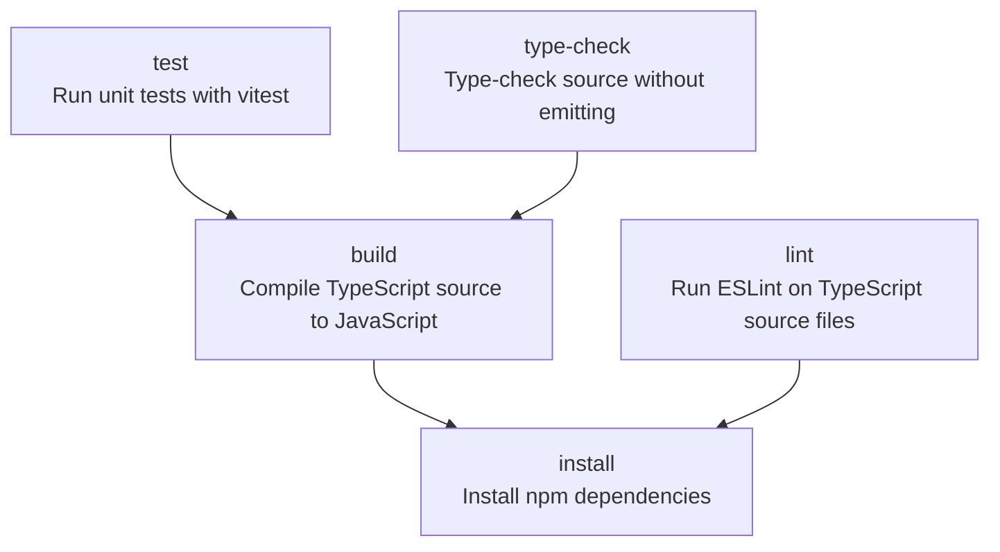

<!-- TOC:START -->
- [language-model-eval](#language-model-eval)
  - [Why this exists](#why-this-exists)
  - [Scope](#scope)
  - [How it works](#how-it-works)
  - [Installation](#installation)
    - [System dependencies](#system-dependencies)
  - [Quick start](#quick-start)
  - [The gold data set](#the-gold-data-set)
    - [`lme gold build` — the populator](#lme-gold-build--the-populator)
    - [`lme gold verify` — validate the ground truth](#lme-gold-verify--validate-the-ground-truth)
  - [The map configuration](#the-map-configuration)
    - [The statement half and the gold half](#the-statement-half-and-the-gold-half)
    - [Which fields are even worth testing](#which-fields-are-even-worth-testing)
  - [The transformation library](#the-transformation-library)
    - [Why `firstToken` is the workhorse](#why-firsttoken-is-the-workhorse)
    - [Gotcha: order matters, and `stripDigits` bites](#gotcha-order-matters-and-stripdigits-bites)
  - [Match keys and the harness blind spot](#match-keys-and-the-harness-blind-spot)
    - [The blind spot](#the-blind-spot)
  - [Matching](#matching)
  - [Scoring](#scoring)
    - [Absolute dollar error](#absolute-dollar-error)
    - [Why not just compare the totals](#why-not-just-compare-the-totals)
    - [Secondary metrics](#secondary-metrics)
    - [Cost is a metric too](#cost-is-a-metric-too)
  - [Acceptance thresholds](#acceptance-thresholds)
  - [Extractors](#extractors)
    - [Always run the baseline](#always-run-the-baseline)
    - [Prompts are part of the experiment](#prompts-are-part-of-the-experiment)
    - [Chunking](#chunking)
    - [A note on structured output](#a-note-on-structured-output)
  - [Run manifests and reproducibility](#run-manifests-and-reproducibility)
    - [Variance](#variance)
    - [On sample sizes](#on-sample-sizes)
  - [Comparing two runs](#comparing-two-runs)
  - [Privacy](#privacy)
  - [Repository layout](#repository-layout)
  - [Build pipeline](#build-pipeline)
  - [Design notes](#design-notes)
    - [Clone, don't `npm install`](#clone-dont-npm-install)
    - [Rejected: a second extractor as the oracle](#rejected-a-second-extractor-as-the-oracle)
    - [What generalizes](#what-generalizes)
<!-- TOC:END -->

# language-model-eval

A harness for measuring how accurately a language model converts **PDF documents
into structured CSV**, scored against a hand-verified gold data set.

The canonical use case — and the one every example here uses — is **bank
statements**: you have twelve months of PDFs from your bank, and what you
actually want is a CSV you can group, filter, and aggregate for tax reporting.
The framework itself is domain-neutral; the bank-specific knowledge lives
entirely in a declarative map configuration, not in the code.

The question this harness answers is not "which model is best." It is:

> For **my** documents, on **my** hardware, with **my** accuracy bar — does this
> model produce a CSV I can actually file taxes from, and how would I know?

---

## Why this exists

A bank gives you two views of the same month: a PDF statement (the official
record, laid out for humans) and — if you are lucky and recent enough — a CSV
export (machine-readable, but usually only 12–18 months of history). Neither is
derived from the other. Columns do not map one-to-one, reference numbers come
from different systems, and descriptions are formatted differently.

That mismatch is what makes this a good evaluation target. Grading a PDF→CSV
extractor normally means a human reads each statement and types the correct
transactions into a target CSV — the **label** every supervised evaluation pays
someone to produce. The bank hands you both artifacts only for recent
months: the PDF, and a CSV export of the same period. Exports cover only the
last 12–18 months, so older months are PDF-only. For any month where both
exist, that label already exists too — the export **is** the target. So you can
ask a model to produce the CSV from the PDF alone and score it against the
export, with no hand-labelling at all.

The period itself is whatever the **PDF prints in its header**: `gold build`
reads it via `statement.periodPattern` and treats it as a closed interval on
posted dates (`start ≤ postedDate ≤ end`, day granularity — no open/closed
endpoint to resolve). The CSV target is then *defined* as the bulk export sliced
to that interval. The PDF fixes the bracket; the CSV inherits it.

Having both artifacts for a month is not the same as the two agreeing on every
row in it. The risk is the **membership rule** at the period edge: we slice the
CSV by *posted* date, but a bank prints a transaction on a statement by its own
cutoff, which can key off *transaction* date. A charge transacted this period
but posted a day into the next is printed on this PDF yet sliced into next
month's CSV — and vice versa. There the export is *not* a trustworthy label for
that row: a model that reads it correctly off the PDF is charged with a
fabrication, and a CSV-only row surfaces as an omission. This is what
[`lme gold verify`](#lme-gold-verify--validate-the-ground-truth) exists to catch
— see the endpoint-alignment check below. A boundary disagreement is a gold-set
defect, not a model error; fix or exclude the statement before scoring.

Once you trust a model on the months where both exist, you can run it on the
older statements where only the PDF survives.

## Scope

**In scope**

- Converting text-extractable PDFs to a transaction-level CSV.
- Scoring a candidate CSV against a gold CSV with domain-appropriate metrics.
- Making a run reproducible: pinned model, pinned prompt, pinned config,
  recorded hardware.
- Comparing runs across models, prompts, quantizations, and machines.

**Out of scope**

- **Crowd-sourced result collection.** Submitting and aggregating results from
  other people's machines is a separate concern and is deliberately not part of
  this repository.
- **OCR.** Scanned or image-only statements are rejected at ingest with a clear
  error. The pipeline extracts a text layer first, so what is measured is
  *text-to-structure*, not *pixels-to-text*. Mixing the two would confound the
  results.
- **Categorization.** Deciding business-vs-personal is downstream of this
  harness.
- **Tax advice.** A green score means the extraction matched your gold set. It
  does not mean your return is correct.

## How it works

```
                       ┌───────────────────────────────┐
  gold/2025-03.pdf ───►│ extractor (model under test)  │──► runs/<id>/2025-03.csv
                       └───────────────────────────────┘             │
                                                                     ▼
                                                         ┌────────────────────┐
  gold/2025-03.csv ─────────────────────────────────────►│ candidate adapter  │
         │                                               └────────────────────┘
         ▼                                                           │
  ┌────────────────┐                                                 │
  │  gold adapter  │                                                 │
  └────────────────┘                                                 │
         │                                                           │
         └──────────────► canonical records ◄────────────────────────┘
                                  │
                                  ▼
                          key function k(·)      ← applied to BOTH sides
                                  │
                                  ▼
                          tiered matcher
                                  │
                                  ▼
                   scoring ──► runs/<id>/report.{json,md}
```

Both sides — the gold CSV and whatever the model emitted — are normalized into
the *same* canonical record shape before anything is compared:

```ts
interface CanonicalTxn {
  postedDate: string;  // ISO 'YYYY-MM-DD'
  amount: number;      // signed integer CENTS, never a float
  payee: string;       // cleaned, but not yet reduced to a key
  raw: Record<string, string>;  // untouched source row, kept for reporting
}
```

Two deliberate choices there:

- **Amounts are integer cents.** Comparing `round(float(x), 2)` values with a
  `±$0.01` tolerance is a workaround for a problem you can simply not have.
  Parse to cents at the boundary and compare exactly.
- **Normalize both sides; don't translate one into the other.** It is tempting
  to write a mapping that turns PDF-side fields into your bank's CSV column
  names. Don't — that bakes one bank's export format into the comparator, and
  the harness stops working the moment you add a second bank.

## Installation

**This is a clone-first tool, not an npm dependency.** See
[Design notes](#design-notes) for the reasoning.

```bash
git clone https://github.com/doikayt/language-model-eval.git
cd language-model-eval
npm install
```

The CLI lives at `bin/lme`. `npm install` links it into `./node_modules/.bin`,
so `npx lme …` works from the repo root without a global install. If you want
it on `PATH` shell-wide, use `npm link` — but pinning matters here (see
[Run manifests](#run-manifests-and-reproducibility)), so running from inside a
checked-out working copy is the intended mode.

### System dependencies

| Tool | Why | NixOS package |
|---|---|---|
| `pdftotext` (poppler-utils) | PDF text-layer extraction | `poppler_utils` |
| `ollama` | Local model runtime (optional) | `ollama` |
| Node.js ≥ 22 | The harness itself | `nodejs_22` |

A `flake.nix` is provided; `nix develop` gives you all three, pinned.

## Quick start

```bash
# 1. Build a gold set from your bank's PDFs plus one bulk CSV export.
npx lme gold build \
  --map    config/banks/bofa.map.yaml \
  --pdfs   inbox/statements \
  --export inbox/export.csv \
  --out    gold/bofa

# 2. Sanity-check the ground truth BEFORE trusting any score derived from it.
npx lme gold verify --map config/banks/bofa.map.yaml --gold gold/bofa

# 3. Establish a non-LLM floor. If the model can't beat this, it isn't
#    earning its runtime.
npx lme run --gold gold/bofa --extractor baseline-regex --label floor

# 4. Run the model under test.
npx lme run \
  --gold      gold/bofa \
  --extractor ollama \
  --model     qwen2.5:7b-instruct-q4_K_M \
  --prompt    config/prompts/extract-transactions.v1.md \
  --repeat    3

# 5. Read the report.
npx lme report  --run runs/<run-id>
npx lme compare runs/<floor-id> runs/<run-id>
```

## The gold data set

A gold set is a directory of **matched pairs** describing the same transactions
two different ways:

```
gold/bofa/
├── 2025-01.pdf     # the statement, exactly as the bank issued it
├── 2025-01.csv     # the bank's CSV export, sliced to that statement period
├── 2025-02.pdf
├── 2025-02.csv
└── manifest.json   # pair index, statement periods, checksums
```

### `lme gold build` — the populator

You will not assemble this by hand. Banks hand you a pile of PDFs and one bulk
CSV export covering an arbitrary date range. `gold build` pairs them up:

1. Extract the text layer from each PDF.
2. Find the statement period using the `statement.periodPattern` regex from
   your map config (or from the filename, if you use a date-bearing
   convention).
3. Slice out rows of the bulk export whose posted date falls inside that
   period.
4. Write `<period-id>.pdf` / `<period-id>.csv` and record both checksums in
   `manifest.json`.

### `lme gold verify` — validate the ground truth

**Do this before you score a single model.** If your gold set is wrong, every
number the harness produces afterwards is wrong in a way no amount of model
tuning will reveal.

`gold verify` performs four checks:

1. **Reconciliation.** Parse the statement's own printed totals (total
   deposits, total withdrawals, ending balance) out of the PDF text and check
   them against the sum of the sliced CSV rows. This is the *one* place where
   comparing signed totals is the right tool: you are checking whether two
   views of the same ledger agree, not scoring a model.
2. **Boundary leakage.** Flag transactions dated within a day or two of a
   period edge. Posted-date-versus-transaction-date drift is the usual cause of
   a row landing in the wrong statement.
3. **Endpoint alignment.** A boundary disagreement can only appear at the head
   or tail of a period, so this check looks only there. Let
   `δ = printedTotal − Σ(sliced CSV rows)` be the reconciliation gap from check
   1. If `δ ≠ 0` **and** the first or last CSV row sits more than the window
   inside the period edge, a transaction present in one view but not the other
   almost certainly accounts for it, and `|δ|` estimates its amount. This is
   the end-of-month case: the PDF's cutoff includes a transaction the CSV
   export's cutoff does not (or vice versa). The check is **pure metadata** — it
   needs the printed totals and the period bounds only, never a per-transaction
   parse of the PDF — so it cannot quote the offending row, only localize it to
   an edge and price it from `δ`. Exclude or re-slice the flagged statement
   before scoring.
4. **Blind-spot analysis.** Report how much of the gold set your match key
   cannot distinguish — see
   [Match keys and the harness blind spot](#match-keys-and-the-harness-blind-spot).

A gold set that fails reconciliation should be fixed or excluded, not scored
against.

## The map configuration

Everything bank-specific is declarative: one YAML file per bank **and account
type**, validated against a schema at load time. The unit is finer than "a
bank": header wording and CSV export columns differ between, say, BofA personal
checking and a BofA credit card, so they need separate configs — name them for
the pair, e.g. `bofa-checking.map.yaml` and `bofa-card.map.yaml`. Note too that
`periodPattern` and the `totals` regexes match the **`pdftotext -layout`
output**, not the on-screen PDF; derive them from your own statements' extracted
text.

```yaml
version: 1
bank: bank-of-america

statement:
  # How the populator locates the statement period in the PDF text layer.
  periodPattern: 'for (?<start>[A-Z][a-z]+ \d{1,2}, \d{4}) to (?<end>[A-Z][a-z]+ \d{1,2}, \d{4})'
  dateFormat: 'MMMM d, yyyy'
  # Printed totals used by `gold verify` reconciliation.
  totals:
    deposits:    'Deposits and other additions\s+\$?([\d,]+\.\d{2})'
    withdrawals: 'Withdrawals and other subtractions\s+\$?([\d,]+\.\d{2})'

# --- bank CSV export  ->  canonical ------------------------------------
gold:
  fields:
    postedDate:
      from: 'Posted Date'
      via: [{ parseDate: { format: 'MM/dd/yyyy' } }]
    amount:
      from: 'Amount'
      via: [{ parseAmount: { groupSep: ',', parensNegative: true } }]
    payee:
      from: 'Payee'
      via: [collapseWhitespace, trim]

# --- extractor output  ->  canonical -----------------------------------
# The prompt asks for these columns, but models do not reliably obey, and a
# third-party extraction tool will have its own schema entirely.
candidate:
  fields:
    postedDate: { from: date,        via: [{ parseDate: { format: 'yyyy-MM-dd' } }] }
    amount:     { from: amount,      via: [{ parseAmount: {} }] }
    payee:      { from: description, via: [collapseWhitespace, trim] }

# --- canonical -> match key. Applied IDENTICALLY to both sides. --------
key:
  postedDate:
    window: 1          # ±1 day, and only at match tier 1
  amount:
    tolerance: 0       # integer cents; exact
  payee:
    via: [upper, stripPunctuation, firstToken]

scoring:
  thresholds:
    absoluteDollarError: { green: 100.00, yellow: 500.00 }
    omissions:           { green: 0, yellow: 1 }
    fabrications:        { green: 0, yellow: 2 }
```

### The statement half and the gold half

Two of the config's sections read your real data, each from a different file, and
it helps to see how they fit together:

- **`statement:` — the PDF envelope.** Runs against the PDF text layer. It says
  *where* a statement's period is (`periodPattern`, `dateFormat`) and *what the
  bank's own printed control totals are* (`totals`). It carries no
  per-transaction detail.
- **`gold:` — the CSV payload.** Runs against the CSV export rows. It says how to
  turn each exported row into a canonical transaction (`postedDate`, `amount`,
  `payee`). It carries the detail but knows nothing about period boundaries.

They meet in two places:

1. **`gold build` uses the envelope to select the payload.**
   `statement.periodPattern` reads `[start, end]` off the PDF; `gold build`
   slices the export down to rows whose posted date falls in that window; `gold:`
   then parses those rows. The envelope picks the window; the payload fills it.
2. **`gold verify` checks the payload against the envelope.** It sums the
   `gold:`-parsed rows and compares that against `statement.totals` read from the
   PDF. The printed totals are the control figure the detail must reconcile to —
   and the [endpoint-alignment check](#lme-gold-verify--validate-the-ground-truth)
   is what fires when a boundary transaction makes the two disagree.

Neither half is derived from the other: they read two files produced by two
different systems (see [Why this exists](#why-this-exists)). That independence is
why account type can change either half on its own — a credit-card PDF header and
a credit-card export's columns move for unrelated reasons.

The other sections aren't about reading source truth: `candidate:` maps a model's
output into the same canonical shape, `key:` reduces a canonical record for
matching, and `scoring:` sets pass/fail thresholds. Those are comparison
machinery, covered below.

### Which fields are even worth testing

Not every column deserves a comparison. For tax reporting the honest list is
short:

| Field | Why it matters | How it is matched |
|---|---|---|
| Posted date | Determines the tax year | Exact, ±1-day window at tier 1 |
| Amount | Determines the deduction value | Exact, in integer cents |
| Payee | Determines categorization | Reduced to a key, then exact |
| Reference number | Traceability | **Not compared** — different systems |
| Merchant address, phone | — | Not compared |

Adding fields you do not act on makes the score look rigorous while making it
less useful: the model gets penalized for errors that cost you nothing, and
real errors get diluted in the average.

## The transformation library

Transformations are pure, total functions on strings, applied left to right.
The chain is a list; order is significant.

| Transformation | Args | Idempotent | Notes |
|---|---|---|---|
| `trim` | — | yes | |
| `collapseWhitespace` | — | yes | Runs of whitespace become one space |
| `upper` / `lower` | — | yes | |
| `stripPunctuation` | — | yes | Unicode-aware |
| `stripDigits` | — | yes | See the gotcha below |
| `firstToken` | — | yes | First run of non-whitespace characters |
| `firstNTokens` | `n` | yes | |
| `regexExtract` | `pattern`, `group` | no | Returns `''` on no match |
| `replace` | `pattern`, `with` | no | |
| `truncate` | `n` | yes | |
| `parseDate` | `format` | — | Terminal; produces an ISO date |
| `parseAmount` | `groupSep`, `decimalSep`, `parensNegative` | — | Terminal; produces cents |

### Why `firstToken` is the workhorse

Bank PDFs mash the vendor name together with the store location and often a
phone number:

```
STARBUCKS STORE 04412 SEATTLE WA 8005551212
```

To characterize a transaction you mostly need the first word. `firstToken` gets
you `STARBUCKS` — and, critically, applied to a gold CSV value that is *already*
clean (`STARBUCKS`) it is a no-op. That is what makes it safe to run on both
sides.

### Gotcha: order matters, and `stripDigits` bites

```
'7-ELEVEN 34521 AUSTIN TX'
  → stripDigits → '-ELEVEN  AUSTIN TX'
  → firstToken  → '-ELEVEN'            ✗ mangled

'7-ELEVEN 34521 AUSTIN TX'
  → firstToken  → '7-ELEVEN'           ✓
```

Use `lme key preview --map <config> --gold <dir>` to see what your chain
actually produces across the whole gold set before you trust it.

## Match keys and the harness blind spot

The key function `k` reduces a canonical record to the tuple the matcher
compares:

```
k(txn) = ( postedDate , amount , keyChain(payee) )
```

Two requirements, both easy to get wrong:

**1. `k` must be applied to both sides.** The lossy payee reduction belongs in
the `key:` section, not in the `gold:` or `candidate:` adapter. Apply it to only
one side and you are comparing `STARBUCKS` against `STARBUCKS STORE 04412`, so
every row fails. This is the single most common way to misconfigure the
harness.

**2. Every transformation in `keyChain` must be idempotent**, i.e.
`f(f(x)) = f(x)`. That is what lets the same chain run over an already-clean
gold value and a messy candidate value and land both in the same equivalence
class. The table above marks which functions qualify; the config validator
rejects non-idempotent transformations inside `key:`.

### The blind spot

A lossy key buys robustness at the cost of resolution. Two gold records sharing
a full match key are **interchangeable** — no matcher can tell them apart, so a
model that swaps them scores perfectly.

Partition the gold set `G` by match key into classes `κ`. The fraction of gold
dollars the harness structurally cannot audit is:

```
        Σ over classes κ with |κ| ≥ 2 of   Σ    |amount(g)|
                                         g ∈ κ
   B = ───────────────────────────────────────────────────
                        Σ    |amount(g)|
                      g ∈ G
```

`lme gold verify` reports `B`. Read it as an upper bound on how much of your
money the score is silently ignoring:

- `B < 2%` — fine.
- `B > 10%` — tighten the key. `firstNTokens: 2` usually collapses it, at the
  cost of more sensitivity to whitespace noise in the PDF.

The classic offender is a key so coarse it merges genuinely different vendors:
`firstToken` maps both `AMAZON MKTPL` and `AMAZON WEB SERVICES` to `AMAZON`. For
a return where one is a deduction and the other is not, that is a real loss of
resolution — and one you would never notice from the accuracy number alone.

## Matching

Gold and candidate are **multisets**, not sets: two $4.50 coffees at the same
vendor on the same day is a normal Tuesday. Matching is therefore a
maximum-cardinality bipartite matching, resolved greedily in tiers. Each tier
runs over whatever the previous tiers left unmatched.

| Tier | Matches on | Classified as |
|---|---|---|
| 0 | Date, amount, payee key — all exact | **exact match** |
| 1 | Amount + payee key, date within window | **date drift** |
| 2 | Date + payee key, amount differs | **amount error** |
| 3 | Date + amount, payee key differs | **payee error** |
| — | Gold rows left over | **omission** |
| — | Candidate rows left over | **fabrication** |

Ties break deterministically — by date, then amount, then payee key, then source
row index — so identical inputs always produce an identical score. Tier order is
part of the run manifest, because changing it changes the numbers.

The two leftover buckets matter most, and they are not symmetric:

- An **omission** is invisible in the output. Nothing in the CSV tells you a row
  is missing; you find it only by reconciling against the statement.
- A **fabrication** is at least visible — a row you can spot-check against the
  PDF and find isn't there.

Hence the stricter default threshold on omissions.

## Scoring

### Absolute dollar error

The metric the harness leads with. Let `M` be the matching, with `a_g` and `a_c`
the gold and candidate amounts:

```
   E =     Σ      |a_g − a_c|   +     Σ      |a_g|   +      Σ      |a_c|
       (g,c) ∈ M                  g unmatched           c unmatched
       ──────────────────         ───────────           ───────────
         amount errors              omissions           fabrications
```

Dollar-weighted accuracy is then:

```
   A = 1 − E / Σ |a_g|
                g∈G
```

`A ≤ 1`, and it is unbounded below — a model that invents transactions can score
negative, which is the correct behaviour.

### Why not just compare the totals

A tempting and much simpler definition is `Σa_c / Σa_g`, or a "dollar drift" of
`|Σa_g − Σa_c|`. **Both cancel errors against each other, and will report that a
badly broken model is perfect.**

Concretely: the model drops a $500 charge and hallucinates a different $500
charge. The signed totals are identical, so drift is `$0.00` and naive accuracy
is `100%`. The absolute dollar error is `$1000` — two wrong transactions, both
of which would land in your return.

Signed net drift is still reported, but labelled a **reconciliation check**, not
an accuracy measure. It is the right tool for validating your
[gold set](#the-gold-data-set) and the wrong tool for scoring a model.

### Secondary metrics

| Metric | Definition |
|---|---|
| Dollar recall | Gold dollars exactly matched ÷ total gold dollars |
| Dollar precision | Candidate dollars exactly matched ÷ total candidate dollars |
| Transaction recall / precision | The same, by count rather than dollars |
| Field error rates | Per field: date drift, amount error, payee error counts |
| Wall clock | Seconds per document, and peak RSS |

Recall and precision are reported separately on purpose. A model that returns
half the transactions perfectly has excellent precision and useless recall, and
a single blended number would hide that.

### Cost is a metric too

On the reference machine — a ThinkPad with an Intel i7-6820HQ (4 cores, no
usable GPU) and 32 GB of RAM — a 7B model at 4-bit quantization runs at
single-digit tokens per second, and a twelve-page statement is a long
generation. A model scoring 99.9% at forty minutes per statement may well lose
to one scoring 99.5% at two minutes. The report puts accuracy and wall clock
side by side and does not collapse them into a single ranking.

## Acceptance thresholds

Thresholds live in the map config, not in the code, because "good enough" is a
property of your use case and not of the framework. The defaults below are a
starting point for personal tax reporting:

| Metric | Green | Yellow (review) | Red (unusable) |
|---|---|---|---|
| Absolute dollar error | < $100 | $100 – $500 | > $500 |
| Omissions | 0 | 1 | > 1 |
| Fabrications | 0 | 1–2 | > 2 |

Set them by asking what the error actually costs. At a 32% marginal rate, a $500
absolute dollar error is roughly $160 of tax exposure plus the hours of
reconciliation needed to find it — and that is the number worth deciding
against.

## Extractors

An extractor is anything satisfying a small shell contract:

```bash
<extractor> --pdf <path> --out <path.csv> [--model <id>] [--prompt <path>]
# exit 0 on success; CSV written to --out; diagnostics on stderr
```

That keeps the harness indifferent to what sits behind it. Bundled adapters:

| Adapter | What it is |
|---|---|
| `baseline-regex` | `pdftotext -layout` plus hand-written regexes. **No model.** |
| `ollama` | Local model via the Ollama HTTP API |
| `claude-proxy` | Routes through claude-proxy for provider swapping |
| `anthropic` | The Anthropic Messages API directly |
| `external` | Wraps any third-party CLI tool |

### Always run the baseline

`baseline-regex` exists to answer the question this project could easily forget
to ask: **is the model adding value over a hundred lines of awk?** For a single
bank with a stable statement layout, regexes are fast, free, and deterministic.
The interesting result is where they break — a new layout, multi-line
descriptions, a page break mid-transaction — and how much better the model does
there. Run the baseline first and treat its score as the floor a model has to
clear.

### Prompts are part of the experiment

Prompts live in `config/prompts/` as versioned files, never inline in code, and
their content hash goes into the run manifest. Changing a prompt invalidates
cross-run comparison; `lme compare` refuses to compare runs with differing
prompt hashes unless you pass `--force`.

### Chunking

Small local models will not hold a twelve-page statement in context. The
extractor chunks by page and concatenates the per-page CSVs. That is honest but
imperfect: a transaction whose description wraps across a page boundary can be
split or dropped. The chunking strategy and window size are recorded in the
manifest because they move the score materially — a model that looks worse may
simply have been chunked worse.

### A note on structured output

The `anthropic` adapter requests a JSON schema rather than free-text CSV, which
removes an entire class of failure: a chatty preamble, or a dropped quote that
corrupts a row. Where a provider supports schema-constrained output, use it —
otherwise the harness ends up measuring formatting compliance as much as
extraction accuracy. Local models via Ollama get a grammar constraint where the
runtime supports one, and a strict CSV parser with a per-row reject list where
it does not. Rejected rows are counted and reported, never silently dropped.

## Run manifests and reproducibility

Every run writes `runs/<run-id>/manifest.json` with everything needed to
reproduce it:

```json
{
  "runId": "2026-08-11T14-22-08Z-qwen25-7b",
  "framework": { "gitSha": "a3f21c8", "dirty": false },
  "config":    { "map": "config/banks/bofa.map.yaml", "sha256": "9c1e…" },
  "prompt":    { "path": "config/prompts/extract-transactions.v1.md",
                 "sha256": "44ba…" },
  "extractor": { "adapter": "ollama", "model": "qwen2.5:7b-instruct-q4_K_M",
                 "digest": "sha256:1f4a…", "temperature": 0, "seed": 42 },
  "chunking":  { "strategy": "page", "overlap": 0 },
  "host":      { "cpu": "Intel i7-6820HQ", "cores": 4, "ramGb": 32,
                 "os": "NixOS 25.05", "node": "v22.14.0" },
  "gold":      { "dir": "gold/bofa", "documents": 12, "transactions": 512 },
  "repeat":    3
}
```

Note `framework.gitSha` and `config.sha256`. The scoring logic is itself part of
the experiment: if the tier order or the key chain changes, scores are no longer
comparable, and the manifest is what lets you notice.

### Variance

Temperature-zero decoding is not deterministic in practice — quantization,
batching, and runtime version all move the output. Use `--repeat N` and read the
**median and interquartile range** of `E`, not a single number. The report shows
per-document results precisely so you can see *which* statement failed rather
than trusting an aggregate.

### On sample sizes

Twelve statements is a small sample, and differences of a few dollars between
two models are noise. When comparing, `lme compare` uses a **paired** test — the
Wilcoxon signed-rank statistic over per-document absolute dollar error — because
both models see exactly the same documents, and pairing removes the
document-to-document variance that dominates an unpaired comparison. Even so, a
p-value from twelve pairs is weak evidence; the per-document failure table is
usually more informative than the aggregate verdict.

## Comparing two runs

```bash
npx lme compare runs/2026-08-11-baseline runs/2026-08-11-qwen25-7b
```

```
DOCUMENT      BASELINE E   QWEN2.5-7B E        Δ   NOTE
2025-01           $0.00          $0.00    $0.00
2025-02          $12.50          $0.00  −$12.50   baseline missed a wrapped desc
2025-03           $0.00          $0.00    $0.00
2025-04           $0.00        $847.11  +$847.11  1 fabrication (dup page-2 row)
…
──────────────────────────────────────────────────────────────────
TOTAL            $61.25        $847.11  +$785.86
Dollar recall    99.94%        99.98%
Omissions             3              0
Fabrications          0              1
Median doc E      $0.00          $0.00
Wilcoxon signed-rank, n=12: p = 0.21  (not significant)

VERDICT  baseline: PASS   qwen2.5-7b: FAIL (fabrication in 2025-04)
```

That output is the whole argument for the framework. The model beat the baseline
on recall and on median document, and still failed — because it invented an $847
transaction, and one invented transaction is disqualifying in a tax context no
matter how good the averages look.

## Privacy

Real bank statements live in this repository's working directory. Handle
accordingly.

- `gold/` and `runs/` are gitignored by default. Nothing derived from real
  statements is ever committed.
- `fixtures/` holds **synthetic** statements — structurally faithful, entirely
  invented — and is committed. The vitest suite runs against fixtures only, so
  CI never touches real data.
- `lme redact --gold <dir> --out fixtures/<name>` generates a fixture set from a
  real gold set: it preserves layout, column structure, and description shapes
  while replacing vendors, amounts, dates, and account numbers. Use it to file a
  bug report without filing your finances alongside it.
- Local model runtimes keep the data on your machine. Hosted API adapters do
  not — the `anthropic` and `claude-proxy` adapters print an explicit warning
  and require `--i-know-this-leaves-my-machine` before the first document.

## Repository layout

```
language-model-eval/
├── bin/
│   └── lme                     # CLI entry point
├── src/
│   ├── canonical/              # CanonicalTxn, cents parsing, date normalization
│   ├── transforms/             # the transformation library
│   ├── map-config/             # schema, loader, validator
│   ├── gold/                   # populator, verifier, blind-spot analysis
│   ├── extractors/             # baseline-regex, ollama, claude-proxy, …
│   ├── matching/               # tiered multiset matcher
│   ├── scoring/                # E, recall/precision, thresholds, Wilcoxon
│   └── report/                 # json + markdown renderers
├── config/
│   ├── banks/                  # one map config per bank
│   │   └── bofa.map.yaml
│   └── prompts/                # versioned, hashed
│       └── extract-transactions.v1.md
├── fixtures/                   # synthetic statements — COMMITTED
├── gold/                       # real statements — GITIGNORED
├── runs/                       # per-run output — GITIGNORED
└── flake.nix
```

Build configuration lives in [`package.json`](package.json) and
[`project.json`](project.json); the release workflow is
[`.github/workflows/release.yml`](.github/workflows/release.yml).

## Build pipeline

<!-- NX_GRAPH:START -->

<!-- NX_GRAPH:END -->

```bash
npm test                    # vitest, against fixtures/ only
npm run ci                  # format check + tests
npm run update-all-format   # prettier + regenerate the doc blocks in this file
```

## Design notes

### Clone, don't `npm install`

The original plan was to publish this as an npm package. It should be a clone
instead — but not for the reason first assumed. npm's `bin` field already puts
executables on `PATH` via `npx` and `node_modules/.bin`, so binary access is not
the deciding factor. The actual reasons:

1. **Reproducibility requires an exact pin.** An evaluation harness whose
   scoring logic can move under a semver range is not an evaluation harness. A
   git SHA in the run manifest is an exact, verifiable pin; `^1.2.0` is not.
2. **The unit of work is a working copy, not a dependency.** The repository
   holds private data, accumulating results, and per-bank configuration. That is
   a workbench you fork, not a library you import.
3. **Map configs and prompts are meant to be edited and versioned by the user.**
   They belong under the user's own version control, which cloning gives for
   free.

[`package.json`](package.json) still declares `"bin": { "lme": "./bin/lme" }` so
`npm link` works for anyone who wants it, and the package stays `"private":
true`. If a genuinely reusable core emerges later, extract it as a published
library and leave the harness a clone.

### Rejected: a second extractor as the oracle

An earlier plan compared model output against a purpose-built financial document
analyzer. With a real gold set that comparison is redundant — you already have
ground truth, and a second extractor is just another candidate with its own
errors, dressed up as an oracle. The `external` adapter is there if you want to
score such a tool *as a candidate*, which is the honest framing.

### What generalizes

Nothing in `src/matching/` or `src/scoring/` knows about banks. Swap the map
config and the same harness scores clinical values out of lab PDFs, or line
items out of invoices. The domain-specific parts are exactly three: which fields
matter, how to normalize them, and what "good enough" means. Everything else is
bookkeeping.

---

Background notes and the source article draft are in
[`docs/LANG-MODEL-EVAL.txt`](docs/LANG-MODEL-EVAL.txt).
